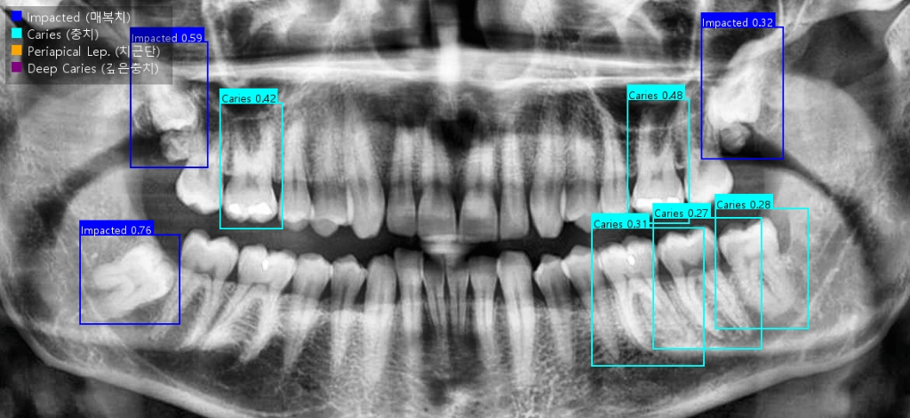
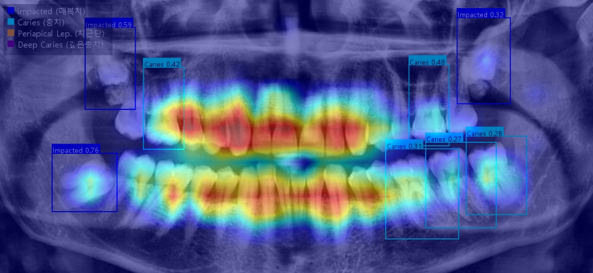

# Caries Detection from Panoramic Radiographs
(파노라마 방사선 사진을 이용한 치아 우식 탐지)

    


## 개요
이 프로젝트는 치과 파노라마 X-ray 이미지에서 우식(Caries)을 자동으로 탐지하는 딥러닝 모델을 개발하고, 이를 임상에서 쉽게 테스트해볼 수 있도록 Streamlit 기반의 웹 UI를 제공하는 것을 목표로 합니다. **특히, 성인뿐만 아니라 혼합치열기(소아) 환자의 데이터까지 학습하여 다양한 연령대에서 활용 가능하도록 개선되었습니다.**

## 주요 기능 (Features)

### 분석 결과 예시 (Analysis Examples)
아래는 파노라마 방사선 사진에 대한 AI 모델의 실제 탐지 및 XAI 히트맵 분석 결과입니다.


*YOLOv11 기반 객체 탐지: 파란색 박스는 매복치(Impacted), 청록색 박스는 충치(Caries)를 의미하며, 모델이 높은 신뢰도로 치과 병소를 찾아냅니다.*


*Eigen-CAM XAI 분석: 모델이 병소를 판별할 때 어느 영역에 시각적 주의(Attention)를 기울였는지 붉은색 히트맵으로 시각화하여, 블랙박스 AI의 한계를 극복하고 의료진의 진단 신뢰도를 높입니다.*

- **Object Detection**: YOLOv11 모델을 사용하여 다음 4가지 핵심 병소를 탐지:
    - `Caries` (충치)
    - `Deep Caries` (심한 충치 / 치수염)
    - `Periapical Lesion` (치근단 병소)
    - `Impacted` (매복치 / 발육 이상)
- **Streamlit UI**: 
    - 웹 브라우저를 통해 손쉽게 이미지를 업로드하고 분석 결과 확인.
    - 분석 결과 이미지에 영문/한글 라벨 범례 자동 표시.
- **Data Support**: DENTEX 및 Pediatric 데이터셋 통합 지원.


## 📦 Model Weights (Hugging Face)
이 모듈의 학습된 가중치 모델은 Hugging Face 저장소에 연동되어 있습니다. 
아래 링크에서 다운로드할 수 있습니다:
- [Hugging Face Repository (chemahc94/Dental-AI-Models)](https://huggingface.co/chemahc94/Dental-AI-Models/tree/main/Dental_002)

다운로드한 가중치 파일은 이 레포지토리의 해당 모델 폴더에 배치하여 사용하세요.

## 설치 및 실행 방법

### 1. 환경 설정 및 설치 (Installation)
Python 3.9 이상이 필요합니다. 이 프로젝트는 **독립적인 Python 패키지(`dentex_caries`)** 로 설계되었습니다.

```bash
# 개발자 모드로 패키지 및 의존성 설치
pip install -e .
```
*(기존 `pip install -r requirements.txt` 방식도 지원합니다.)*

### 2. 가중치 준비 (Weights)
최종 정제된 성능 고도화 모델인 `best_refined.pt`가 `models/` 폴더에 위치해야 합니다. (기본 모델로 자동 세팅됨)

### 3. 애플리케이션 실행 (Run Web App)
로컬에서 앱을 실행하여 테스트할 수 있습니다.
```bash
streamlit run app.py
```

### 4. 라이브러리 사용법 (Library Usage)
다른 파이썬 프로젝트에서 모듈로 임포트하여 사용할 수 있습니다.
```python
import cv2
from dentex_caries import CariesDetector

# 모델 로드 및 추론
detector = CariesDetector("models/best_refined.pt")
image = cv2.imread("panorama.jpg")
preds, processed_img = detector.predict(image)

# XAI 판단 근거 확인
heatmap, _ = detector.explain("panorama.jpg")
```

## 배포 (Deployment)

### Docker 빌드 및 실행 (Recommended)
환경 문제 없이 어디서나 구동 가능한 도커를 지원합니다.
```bash
# 도커 이미지 빌드
docker build -t dentex-caries .

# 컨테이너 백그라운드 실행
docker run -d -p 8501:8501 dentex-caries
```

### Streamlit Cloud 배포
1. GitHub 저장소에 Push
2. Streamlit Cloud에서 해당 저장소 연결
3. `app.py`를 메인 파일로 설정하여 배포

> **[Troubleshooting] OpenCV ImportError가 발생할 경우:**
> Streamlit Cloud 대시보드의 **App settings -> General -> Python version** 설정이 `3.14` 등 최신 버전으로 되어 있을 경우 `cv2` 모듈 임포트 에러가 발생할 수 있습니다. 해당 드롭다운을 **`3.11`** 로 수동 변경한 뒤 **Save changes**를 눌러주세요.

## 테스트 (Testing)
프로젝트 핵심 로직(`dentex_caries` 라이브러리)에 대한 단위 테스트가 구현되어 있습니다.
```bash
# 전체 테스트 및 커버리지 확인
pytest tests/ --cov=src/dentex_caries --cov-report=term
```
*(현재 상태: `8 passed` 정상 통과 완료)*

## 기술 스택 (Tech Stack)
- **Model**: YOLOv11 (Ultralytics)
- **Framework**: PyTorch
- **UI**: Streamlit
- **Image Processing**: OpenCV, Pillow

## 참고 문헌 및 레퍼런스 (References)
1. **DENTEX Challenge 2023**: [Link](https://dentex.grand-challenge.org/)
2. **YOLOv11**: [Ultralytics](https://github.com/ultralytics/ultralytics)
3. **Detection of Dental Anomalies in Digital Panoramic Images Using YOLO**: Uğur Şevik et al. (2025)

## 모델 가중치 (Model Weights)
학습된 모델 가중치는 Hugging Face Hub에서 자동으로 다운로드됩니다. 로컬에 `models/best_refined.pt`가 없는 경우 앱 구동 시 자동 Fallback이 작동합니다.
- **HF Repository**: [`chemahc94/caries-detection-weights`](https://huggingface.co/chemahc94/caries-detection-weights)
- **파일 목록**: `best.pt` (기본 모델), `best_refined.pt` (성능 고도화 모델)

수동 다운로드가 필요한 경우:
```python
from huggingface_hub import hf_hub_download
hf_hub_download(repo_id="chemahc94/caries-detection-weights", filename="best_refined.pt", local_dir="models")
```

## 학습 데이터셋 출처 (Dataset Sources)
- **DENTEX Challenge 2023** (Primary): MICCAI 2023 Grand Challenge에서 제공된 치과 파노라마 방사선 사진 공개 데이터셋. 4가지 병소(Caries, Deep Caries, Periapical Lesion, Impacted) 어노테이션 포함. [https://dentex.grand-challenge.org/](https://dentex.grand-challenge.org/)
- **Pediatric Dataset** (Supplementary): 소아 혼합치열기 환자의 파노라마 이미지를 추가 수집하여 다양한 연령대 커버리지를 확보함.

## 라이선스 (License)
MIT License

