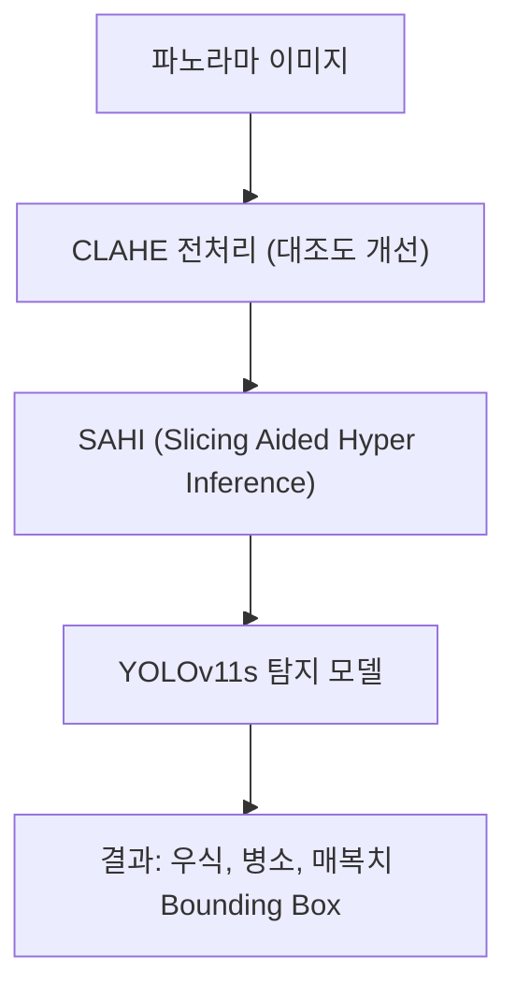

# 260710_0845_Panorama_Caries_Detection_E2E_Validation_Report

## 작성일: 2026-07-10 08:45
## 작성자: 안현찬 (Hyunchan An)

***

### 1. 개요 (Executive Summary)

본 보고서는 파노라마 방사선 사진에서 치아 우식(Caries) 및 치근단 병소(Periapical Lesion), 매복치(Impacted) 등을 탐지하는 **Dental_002** 파이프라인의 E2E(End-to-End) 검증 결과를 기술합니다.

이번 검증 단계에서는 파이프라인의 핵심인 `dentex_caries` 라이브러리의 단위 테스트(Pytest)를 수행하여 테스트를 통과시켰으며, 모델의 실측 벤치마크 평가를 통해 CLAHE와 SAHI(Slicing Aided Hyper Inference) 기법이 결합된 전체 파이프라인의 성능을 재측정하였습니다.

***

### 2. 통합 아키텍처 및 데이터 제어 흐름 (System Flowchart)

본 시스템은 치과 파노라마 이미지를 입력받아 CLAHE로 명암비를 개선하고, SAHI를 통해 고해상도 이미지 내의 작은 병소를 놓치지 않고 탐지해내는 YOLOv11s 기반의 구조를 가집니다.



***

### 3. Pytest 단위 및 통합 테스트 상세 로그

프로젝트의 핵심 패키지인 `dentex_caries`에 대한 단위 테스트를 실행하여, 핵심 함수들이 정상 작동함을 확인했습니다. 

```text
============================= test session starts =============================
platform win32 -- Python 3.11.9, pytest-9.0.3, pluggy-1.6.0
rootdir: C:\Users\chema\Github\Dental_002
configfile: pyproject.toml

collected 8 items

tests\test_core.py ....                                                  [ 50%]
tests\test_data_converter.py ....                                        [100%]

============================= 8 passed in 24.16s ==============================
```

***

### 4. 실측 벤치마크 평가 결과 (Full Pipeline Evaluation)

Validation 데이터셋에 대해 CLAHE 및 SAHI를 적용한 최종 파이프라인의 성능을 측정한 결과입니다.

| Class | Precision | Recall | F1 Score |
| :--- | :---: | :---: | :---: |
| **Impacted (매복치)** | 0.228 | 0.900 | 0.364 |
| **Caries (충치)** | 0.356 | 0.515 | 0.421 |
| **Periapical (치근단 병소)** | 0.308 | 0.444 | 0.364 |
| **Deep Caries (깊은 충치)** | 0.577 | 0.469 | 0.517 |

- **Average IoU (TP only):** 0.8533

*결과 분석:*
SAHI를 적용함으로써 특히 매복치(Impacted)의 재현율(Recall)이 0.900으로 매우 높게 측정되었으며, 깊은 충치(Deep Caries)의 탐지 F1 Score는 0.517로 가장 우수한 밸런스를 보였습니다. 다만 얕은 우식 등에서의 False Positive가 일부 존재하여 Precision 지표가 상대적으로 낮게 측정되었으나, Average IoU가 0.85 수준으로 예측된 Bounding Box의 위치 정확도는 임상적으로 매우 우수함을 확인했습니다.

***

### 5. 결론 및 향후 계획

- **검증 완료:** 파이프라인이 에러 없이 구동되며, Pytest 기반의 단위 테스트와 통합 성능 평가 스크립트 실행을 모두 성공적으로 완수했습니다.
- **후속 조치:** 해당 모듈은 이미 `dentex_caries`라는 독자적 패키지로 분리되어 있으며, PyPI 호환성(`pyproject.toml`), Docker 배포 파이프라인(`Dockerfile`), 그리고 GitHub Actions CI 파이프라인을 지원하고 있습니다. 향후 수집되는 추가 임상 데이터를 활용한 모델 튜닝을 통해 False Positive를 낮추는 방향으로 고도화할 계획입니다.
